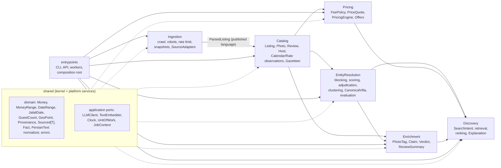
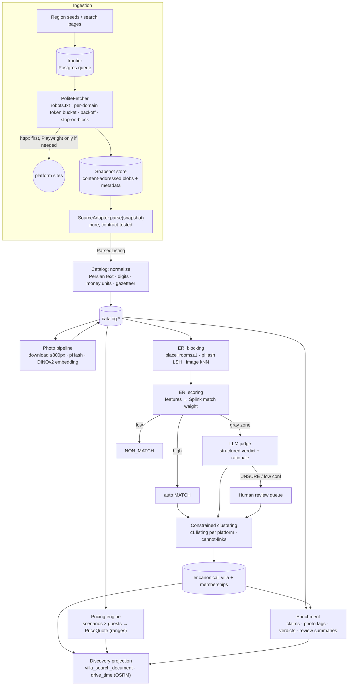
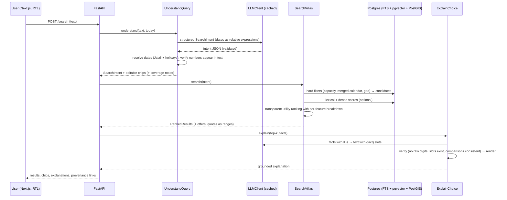
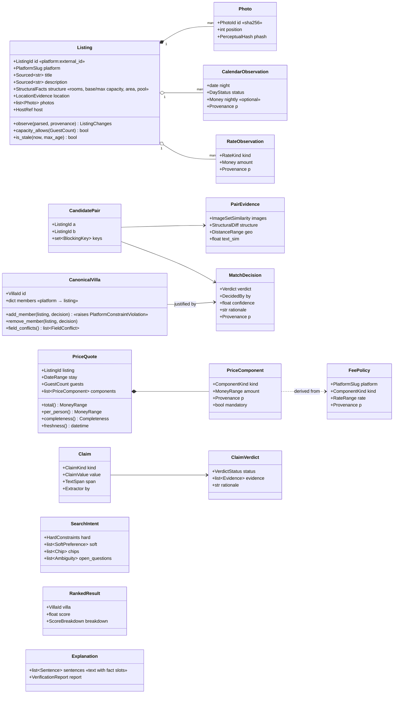
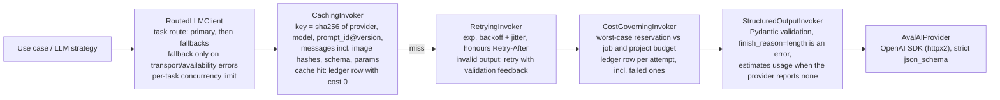
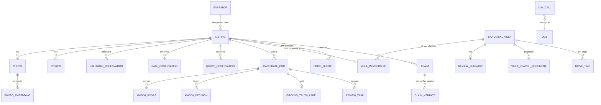

# Villasanj — Architecture

> «ویلاسنج: یک ویلا، همه‌ی حقیقت». Each real villa gets one canonical page that aggregates its
> listings across Iranian rental platforms: all-in offers for a concrete stay and group size, a merged
> calendar, aggregated reviews, and a "truth check" of listing claims against evidence.
>
> Status: **Milestone 0 (design).** No executable code exists yet. Decisions are recorded in
> [`docs/adr/`](adr/README.md); the plan and acceptance criteria live in [`ROADMAP.md`](ROADMAP.md).

---

## 1. Goals and quality attributes

The Torob challenge pipeline is *crawl offers → normalize messy data → rank by user intent → explain the
best choice*. Villasanj implements that pipeline for villas. The hard part is **entity resolution without
a shared identifier** (a villa has no barcode).

| Quality attribute | What it means here | How the architecture enforces it |
|---|---|---|
| **Truthfulness** | No fabricated number, ever. Every price/claim carries source + timestamp. Unknown ⇒ range or explicit "unknown". | `Sourced[T]`/`Provenance` value objects in the shared kernel; `MoneyRange` in pricing; slot-based LLM generation + deterministic verifier ([ADR-0007](adr/0007-provenance-and-no-fabricated-numbers.md)). |
| **Merge precision ≥ 95%** | A wrong merge is worse than a missed merge. | Staged ER, precision-first thresholds, "≤ 1 listing per platform" invariant, human review queue, human-labelled gold set with CIs ([ADR-0009](adr/0009-entity-resolution-strategy.md)). |
| **Reproducibility** | Re-running the pipeline gives the same result without re-crawling or re-paying. | Raw snapshots are immutable and content-addressed; parsing is a pure function of a snapshot; persistent LLM cache; evaluation reports keyed by dataset hash. |
| **Extensibility (real OCP)** | New platform / LLM provider / embedding model / search engine = new adapter + registration. | Ports in application layers; adapters in infrastructure; entry-point registry for sources; config-driven model routing. Enforced by `import-linter` contracts and an architecture test. |
| **Cost control** | Limited LLM credit. | LLM decorator chain: cache → fallback → retry → cost governor (budget + ledger); dry-run planning; deterministic-first extraction ([ADR-0004](adr/0004-llm-gateway-avalai.md)). |
| **Ethical crawling** | Respect robots.txt, identify ourselves, never bypass protections. | `PoliteFetcher` (robots + per-domain rate limit + stop-on-block); snapshots-first development ([ADR-0008](adr/0008-ethical-crawling.md)). |
| **Runs on a 16 GB laptop** | Apple M4, Docker Desktop with ~7.75 GB. | Compose profiles, one Postgres, no JVM services, CPU-only inference in Docker ([ADR-0003](adr/0003-local-infrastructure-and-hardware-budget.md)). |

---

## 2. Bounded contexts

### 2.1 Critique of the initial proposal

The brief proposed: Ingestion, Normalization, EntityResolution, Pricing, Enrichment, Search & Ranking,
Explanation, ReviewQueue, API/Web. Changes, with reasons:

| Proposed | Decision | Why |
|---|---|---|
| API/Web | **Not a context.** It is the delivery layer (`entrypoints/`). | It has no domain model of its own; treating it as a context invites business logic in controllers. |
| Normalization | **Split**: source-specific normalization lives in each `SourceAdapter` (anti-corruption layer); source-agnostic Persian text/number/place normalization is a **shared-kernel** module. | Normalization has no aggregates or lifecycle, only pure functions. Making it a context would create a pass-through layer. |
| *(missing)* | **Add `Catalog`.** It owns `Listing`, `Photo`, `Review`, `Host`, calendar and rate observations. | Ingestion owns crawling (technical and volatile). Something stable must own the normalized listing. |
| ReviewQueue | **Folded into EntityResolution** as *Adjudication* (LLM judge + human review of match decisions and gold labels). | Its only consumer is ER. A generic review queue for other contexts, such as host disputes, is YAGNI until one exists. |
| Explanation + Search & Ranking | **Merged into `Discovery`**: intent → retrieval → ranking → explanation. | Explanation always explains a ranking or an offer comparison. The grounding primitives (`Fact`, verifier) sit in the shared kernel because review summaries use them too. |
| Enrichment | **Kept**, scoped to *derived knowledge about content*: photo tags, claims, claim verdicts (truth check), review summaries. | It is a cohesive "understand the listing" stage with its own lifecycle (versioned extractors/models). |

### 2.2 Final context map



Allowed dependency direction between contexts (enforced by `import-linter`):
`shared ← ingestion ← catalog ← {entity_resolution, pricing} ← enrichment ← discovery ← entrypoints`.
`pricing` and `entity_resolution` are independent of each other. `enrichment` depends on
`entity_resolution` because review summaries are per canonical villa. A downstream context may import
an upstream context's **domain** types and **application** ports, but never its infrastructure.

| Context | Owns (aggregates / key types) | Main use cases |
|---|---|---|
| **Ingestion** | `CrawlRun`, `FrontierItem`, `Snapshot`, `SourceProfile`, `ParsedListing` (DTO) | `CrawlPlatform`, `ReparseSnapshots`, `AuditRobots` |
| **Catalog** | `Listing` (root) with `Photo`, `Amenity`, `Host`, `Review`, `CalendarObservation`, `RateObservation`, `QuoteObservation`; `Place` (gazetteer) | `UpsertListingFromParsed`, `DownloadPhotos`, `ComputePhotoHashes` |
| **EntityResolution** | `CandidatePair`, `PairEvidence`, `MatchScore`, `MatchDecision`, `ReviewTask`, `GroundTruthLabel`, `CanonicalVilla` (root) with memberships and photo groups, `EvaluationRun` | `GenerateCandidates`, `ScorePairs`, `AdjudicateGrayZone`, `BuildCanonicalVillas`, `RecordHumanDecision`, `LabelPair`, `EvaluateMatcher` |
| **Pricing** | `FeePolicy`, `PricingScenario`, `PriceQuote` (with `PriceComponent`s), `Offer` (read model) | `ComputeQuotes`, `BuildOffers` |
| **Enrichment** | `PhotoTag`, `Claim`, `Evidence`, `ClaimVerdict`, `ReviewSummary` | `TagPhotos`, `ExtractClaims`, `VerifyClaims`, `SummarizeReviews` |
| **Discovery** | `SearchIntent` (+ `Chip`s), `RankingPolicy`, `RankedResult`, `Explanation`, `VillaSearchDocument` (read model), `DriveTime` | `UnderstandQuery`, `SearchVillas`, `ExplainChoice`, `ProjectSearchDocuments`, `ComputeDriveTimes` |

---

## 3. Layers inside each context

```
<context>/
  domain/          # entities, value objects, domain services, domain errors — stdlib only
  application/     # use cases, ports (typing.Protocol), DTOs, prompt templates (LLM strategies)
  infrastructure/  # adapters: SQLAlchemy repos, HTTP clients, parsers, ML models, AvalAI, OSRM
```

Rules (checked in CI):

1. `domain` imports only the stdlib and `shared.domain`. **No** pydantic, sqlalchemy, httpx, openai,
   torch, fastapi. Value objects are `@dataclass(frozen=True, slots=True)`.
2. `application` imports `domain`, `shared.application` and upstream contexts' domain/application.
   Pydantic (DTOs, LLM output schemas) and structlog (logging) are **allowed here**. This is a deliberate trade-off: it
   couples use cases to a stable validation library, but otherwise every schema would be written twice.
   Mapping from DTOs to domain objects happens in application code.
3. `infrastructure` implements ports. It is the only layer allowed to import vendors.
4. `entrypoints/container.py` is the **composition root**: hand-written factory functions per
   entrypoint (CLI, API, worker). No DI framework. Dependencies are explicit constructor arguments, and
   the root is the only place that knows which adapter implements which port.
5. No platform slug (`"jabama"`, …) may appear outside `ingestion/infrastructure/sources/<slug>/`, config
   and tests. Platform-specific facts reach the core as data (`SourceProfile`, `FeePolicy`). An
   architecture test greps for this.

### 3.1 Where LLM prompts live

LLM-backed strategies such as `LlmClaimExtractor` and `LlmMatchJudge` are **application** code. They
orchestrate the `LLMClient` port with a versioned prompt template and a Pydantic output schema. The
vendor adapter (`AvalAIProvider`) is infrastructure. The design is deterministic-first: a use case
composes strategies, e.g. `CompositeClaimExtractor([RegexClaimExtractor, LlmClaimExtractor])`, and the
LLM only receives what the deterministic step could not resolve.

---

## 4. Component and data-flow view

### 4.1 Offline pipeline



### 4.2 Online request path (search)



---

## 5. Domain model

### 5.1 Shared kernel (value objects, all immutable)

| Type | Invariants / behaviour |
|---|---|
| `Money(amount_rial: int)` | Non-negative. Stored in **rial** (integer); formatted as toman. Constructors `from_toman()`, `from_rial()`. Parsing of «هزار تومان»/«میلیون» happens in the normalizer, not here. Arithmetic `+`, `*int`, comparison. |
| `MoneyRange(low: Money, high: Money \| None)` | `low ≤ high`; `high=None` means an open upper bound ("≥ low"). `exact()` iff `low == high`. Range arithmetic (`+`), `scale(n)`. |
| `DateRange(check_in: date, check_out: date)` | `check_in < check_out`; `nights()` yields each night's date (check-out exclusive); `overlaps()`. |
| `JalaliDate` | Pure-Python Gregorian↔Jalali conversion (no library), property-tested against `jdatetime` in tests only. |
| `GuestCount(value: int)` | `1 ≤ value ≤ MAX_GUESTS` (named constant). |
| `GeoPoint(lat, lon)` | Range-checked. `distance_m(other)` (haversine). |
| `LocationEvidence(point, precision_m, basis)` | Captures obfuscation: `distance_range_m(other) → (min, max)`. |
| `Provenance(source: SourceRef, snapshot_id, observed_at, method)` | `method ∈ {OBSERVED, DERIVED, LLM_EXTRACTED, HUMAN}`; `DERIVED` carries input provenance ids. |
| `Sourced[T](value: T, provenance: Provenance)` | Generic wrapper used for every user-visible observed value. |
| `Fact(id, kind, value, unit, provenance)` | Grounding unit for LLM text; the only way numbers reach generated prose. |
| `PersianText` normalizer (functions) | Arabic→Persian ی/ک, digit unification, ZWNJ rules, whitespace, punctuation; idempotent (property-tested). |

### 5.2 Context models



Key domain rules:

* **Pricing:** `total = Σ nightly(night) + max(0, guests − base_capacity) × extra_guest_rate × nights +
  guest_service_fee + mandatory_declared_fees − public_discounts`. Every component is a `MoneyRange`
  with provenance. A component with no source at all yields an **open upper bound**; we never invent a
  cap. A platform's direct quote (`QuoteObservation`), when available, overrides the computed total and
  is shown together with the computation. Prices are **never merged** across listings; each member
  listing produces its own `Offer`. The engine returns `QuoteUnavailable(reason)` for capacity exceeded,
  min-nights violated, night unavailable, or rate unknown.
* **Canonical villa:** at most one member per platform (invariant in the aggregate **and** a unique
  index in the DB). Human decisions dominate LLM decisions, which dominate model decisions
  (`DecidedBy` precedence). Canonical IDs stay stable across re-runs: a new clustering is reconciled
  with existing villas by maximum member overlap, and splits and merges are recorded.
* **Truth check:** `VerdictStatus ∈ {SUPPORTED, NOT_VERIFIABLE, CONTRADICTED, INCONSISTENT_ACROSS_PLATFORMS}`.
  `CONTRADICTED` requires that **even the most favourable end** of the evidence range contradicts the
  claim. Example: the claim is "5 min to the sea", and even the minimum possible distance under
  coordinate obfuscation is too far for a 5-minute walk or drive. UI copy never says "lie".
* **Availability:** we store *observations* («در جاجیگا خالی نمایش داده می‌شد، ۳ ساعت پیش»), never
  "is available". A night that is free on one platform and booked on another is a finding and a
  risk signal (possible stale sync), not a guarantee.

### 5.3 Domain errors

`VillasanjError` → `DomainError` (`InvalidMoney`, `InvalidDateRange`, `InvalidGuestCount`,
`PlatformConstraintViolation`, `QuoteUnavailable`) and `ApplicationError` (`BudgetExceeded`,
`LLMOutputInvalid`, `LLMUnavailable`, `CrawlDisallowed`, `SourceBlocked`, `SnapshotNotFound`,
`ParseError(platform, snapshot_id, reason)`). Error messages never contain secrets or raw response bodies.

---

## 6. Ports and adapters

| Port (layer) | Purpose | Adapters (planned) |
|---|---|---|
| `SourceAdapter` (ingestion.application) | `profile`, `seed_requests(region)`, `discover(page, region)`, `parse_listing(page) → ParsedListing`, `parse_calendar(page) → ParsedCalendar` (for platforms that serve calendars separately). **No I/O.** Contract-tested on trimmed fixtures. | `jabama`, `shab` (built in M2); `jajiga`/`otaghak`/`mihmansho` only with written permission (ADR-0011). Registered via the `villasanj.sources` entry-point group. |
| `Fetcher` (ingestion.application) | Fetch one `PageRequest` → `FetchedPage`; never follows redirects itself. | `HttpxFetcher` (standard `Accept`, no cookies kept), wrapped by `PoliteFetcher` (host allow-list, RFC 9309 robots re-checked per redirect hop, per-host pacing with Crawl-delay + jitter, stop-on-block). `SnapshotReplayFetcher` for offline mode. |
| `RobotsPolicy` | Is a URL allowed for our UA? Crawl-delay? | `ProtegoRobotsPolicy` (robots.txt cached as a snapshot). |
| `SnapshotStore` / `BlobStore` | Immutable content-addressed bytes + metadata. | `LocalFsBlobStore` (Docker volume). `S3BlobStore` only if needed ([ADR-0002](adr/0002-technology-stack.md)). |
| Repositories + `UnitOfWork` (each context's application) | Persistence of aggregates. | SQLAlchemy 2 (async, psycopg 3). In-memory fakes for unit tests. |
| `PerceptualHasher` (catalog.application) | pHash/dHash of image bytes. | `ImagehashHasher`. |
| `ImageEmbedder` (catalog.application) | Image → vector. | `Dinov2Embedder` (CPU in Docker; optional host MPS), `SiglipEmbedder` (zero-shot tags, M9). |
| `PairScorer` (er.application) | Evidence → `MatchScore`. | `RuleBaselineScorer` (M3), `SplinkScorer` (M5). |
| `MatchJudge` (er.application) | Gray-zone pair → structured verdict. | `LlmMatchJudge` (application strategy over `LLMClient`). |
| `LLMClient` (shared.application) | `generate(request: LLMRequest[T], ctx: JobContext) → LLMResponse[T]`, multimodal messages, Pydantic-validated output. | `AvalAIProvider` + decorators (`Caching`, `Fallback`, `Retrying`, `CostGoverning`), `FakeLLMProvider` (deterministic, scripted), `OllamaProvider` (future). |
| `TextEmbedder` (shared.application) | Text → vector. | `AvalAIEmbedder` (default), `LocalSentenceEmbedder` (bge-m3, optional) ([ADR-0006](adr/0006-embeddings-text-and-image.md)). |
| `Gazetteer` (catalog.domain) | Resolve place names/aliases → `Place`. | `load_gazetteer` reads `config/gazetteer.toml` (v1: 117 places curated from observed names; OSM not used yet). |
| `RoutingService` (discovery.application) | Free-flow drive time/distance between points. | `OsrmRoutingService`. |
| `CoastlineIndex` (enrichment.application) | Distance from a point to the Caspian coastline. | `PostgisCoastlineIndex` (OSM `natural=coastline`). |
| `SearchIndex` (discovery.application) | Lexical (+ optional dense) scoring over candidates. | `PostgresSearchIndex` (FTS `simple` config on normalized text + `pg_trgm` + pgvector). Swappable for OpenSearch without touching use cases. |
| `Clock`, `IdGenerator` (shared.application) | Deterministic tests. | `SystemClock`, `FixedClock`. |

### 6.1 LLM decorator chain (as built in M1)



Routing sits **above** the cache because cache keys are per model: a fallback answer is cached under
the fallback model and never served for the primary.

Dry-run is a **planning** feature, not a fake provider. Each LLM-using use case implements
`plan() → list[LLMRequest]`. `--dry-run` subtracts cache hits, estimates tokens and cost from the
calibrated per-model estimator and the pricing snapshot, prints the report, and exits without calling
the provider (`make dry-run JOB=llm-smoke`).

### 6.2 Published language between Ingestion and Catalog (as built in M2)

`ParsedListing` (title, description, type, city, **locality**, `GeoPoint` + obfuscation radius, rooms,
area, base/extra capacity, rating, check-in/out, instant booking, opaque host ref, cancellation text,
VAT flag, `ParsedRateCard`, photos, amenities, platform distance claims, calendar) and `ParsedCalendar`
(for calendars served on their own page). Money is already `Money`: each adapter knows its platform's
unit (jabama publishes rial, shab toman). Catalog normalizes Persian text, keeps provenance, and stores
calendar observations append-only.

### 6.3 Extension recipes (the OCP test)

* **New platform (e.g. Homsa):** add `ingestion/infrastructure/sources/homsa/` implementing
  `SourceAdapter`; add fixtures + contract tests; add one entry point in `pyproject.toml`; add a
  `FeePolicy` data row with its source. No change to catalog, ER, pricing, enrichment or discovery.
* **New LLM provider (e.g. local Ollama):** add `OllamaProvider` implementing the provider port;
  set `LLM__PROVIDER=ollama` and model names in `config/llm.toml`. Decorators and use cases are unchanged.
* **New embedding model:** add an `ImageEmbedder`/`TextEmbedder` adapter; the `model_id` column keeps
  vectors from different models apart. No schema change.
* **New search engine:** implement `SearchIndex`; switch in the composition root.

---

## 7. Persistence

One PostgreSQL 17 instance with PostGIS and pgvector, **one schema per context** (`ingestion`,
`catalog`, `er`, `pricing`, `enrichment`, `discovery`, `ops`). Alembic migrations. Postgres doubles as
the crawl queue (`SELECT … FOR UPDATE SKIP LOCKED`) and the LLM cache/ledger store
([ADR-0010](adr/0010-persistence-postgres.md)).



Main tables (columns abbreviated; every observed value carries `snapshot_id` + `observed_at`):

| Schema.table | Key columns |
|---|---|
| `ingestion.crawl_run` | id, platform, live, status, report jsonb, started_at, finished_at *(built M2)* |
| `ingestion.frontier` | id, platform, request_key (unique), kind, method, url, body, headers, context, status, attempts, next_attempt_at, last_error, discovered_from, snapshot_id *(built M2)* |
| `ingestion.snapshot` | id, platform, request_key, kind, method, url, request_headers, request_body, context, status, final_url, headers, blob_key, size, fetcher, fetched_at, run_id *(built M2)* |
| `catalog.listing` | (platform, external_id) PK, url, title, title_norm, description, description_norm, property_type, city_fa, city_slug, locality_fa, lat, lon, **geog** (generated PostGIS geography), location_radius_m, bedrooms, bathrooms, area_m2, base/extra capacity, rating, check-in/out, min_nights, instant_booking, host_ref, cancellation text, vat_applies, rate card (6 rial columns), photos/amenities/distance_claims jsonb, snapshot_id, observed_at *(built M2)* |
| `catalog.calendar_observation` | (platform, external_id, night, snapshot_id) PK, availability, nightly_rial, extra_guest_rial, min_nights, is_holiday, observed_at *(built M2; append-only)* |
| `catalog.photo` | (platform, external_id, position) PK, url, snapshot_id, sha256, width, height, phash, dhash, observed_at *(built M2)* |
| `catalog.parse_failure` | snapshot_id PK, platform, reason *(quarantine, built M2)* |
| `catalog.place` | gazetteer (planned; M2 keeps it as versioned config) |
| `catalog.photo_embedding` | photo_id, model_id, embedding vector (partial HNSW index per model) *(planned M5)* |
| `catalog.review` | listing, platform_review_id, rating, text_norm, stayed_on (no reviewer names) *(planned M10)* |
| `catalog.quote_observation` | listing, check_in, check_out, guests, total, breakdown *(only if a platform publishes direct quotes)* |
| `er.candidate_pair` | id, listing_a < listing_b, blocking_keys text[], created_run_id |
| `er.match_score` | pair_id, run_id, scorer, probability, match_weight, breakdown jsonb, features jsonb |
| `er.match_decision` | id, pair_id, verdict, decided_by, actor, confidence, rationale, evidence jsonb, created_at, supersedes_id |
| `er.review_task` | id, pair_id, reason, priority, status, resolved_decision_id |
| `er.ground_truth_label` | pair_id, label (match/non_match/unsure), annotator, note, stratum, labeled_at |
| `er.canonical_villa` | id, slug, created_at, retired_at, merged_into |
| `er.villa_membership` | villa_id, listing_id (unique), platform, **unique(villa_id, platform)**, since_run_id |
| `er.photo_group` | id, villa_id, representative_photo_id, member_photo_ids |
| `er.evaluation_run` | id, dataset_hash, params jsonb, metrics jsonb, created_at, code_version |
| `pricing.fee_policy` | platform, component, rate_min, rate_max, basis, source_url, snapshot_id, observed_at |
| `pricing.scenario` | id, name, check_in, check_out, guests |
| `pricing.price_quote` | listing_id, scenario_id, total_min_rial, total_max_rial, components jsonb, completeness, computed_at, inputs_observed_at_min |
| `enrichment.photo_tag` | photo_id, tag, score, model_id |
| `enrichment.claim` | id, listing_id, kind, value jsonb, span int4range, source_text, extractor |
| `enrichment.claim_verdict` | claim_id, status, evidence jsonb, rationale, verifier_version |
| `enrichment.review_summary` | villa_id, content jsonb (points + cited review ids), model_id, input_hash, verified |
| `discovery.villa_search_document` | villa_id, tsv tsvector, embedding vector, facets jsonb, refreshed_at |
| `discovery.drive_time` | villa_id, origin_id, seconds_min, seconds_max, meters, osrm_dataset, computed_at |
| `ops.job` | id, kind, params jsonb, budget_usd, spent_usd, status, started_at, finished_at |
| `ops.llm_cache` | key (sha256 pk), task, model, response jsonb, usage jsonb, created_at |
| `ops.llm_call` | id, job_id, task, model, attempt, cache_hit, input/cached/output/reasoning tokens, usage_source (reported/estimated), cost_usd, latency_ms, status, error_code |

---

## 8. Runtime topology (docker compose)

Services without a profile start with `make up`; the others join with their profile.

| Service | Profile | Host port | Notes |
|---|---|---|---|
| `db` | — | `127.0.0.1:5433` | Custom image `FROM postgres:17` + PGDG PostGIS 3.6 + pgvector 0.8 (native arm64). |
| `migrate` | — | — | One-shot `alembic upgrade head`; `api` waits for it to complete. |
| `api` | — | `127.0.0.1:8800` | FastAPI (uvicorn). `/health/live` for the container healthcheck, `/health` for readiness. |
| `web` | — | `127.0.0.1:3300` | Next.js standalone build; `/api/health` proxies the API (end-to-end check). |
| `worker` | pipeline (M2) | — | Typer CLI jobs: crawl, parse, photos, match, price, enrich, project. Includes torch CPU. |
| `browser` | pipeline (M2) | — | Playwright Chromium; only started when an adapter needs JS rendering. |
| `osrm` | routing (M8) | — | `osrm-routed` on an MLD graph built from a **clipped** Tehran–Caspian extract. |
| `osrm-prep` | routing (M8) | — | Download Geofabrik Iran → `osmium extract` bbox → `osrm-extract/partition/customize`. |

Host ports are overridable (`VILLASANJ_DB_PORT`, `VILLASANJ_API_PORT`, `VILLASANJ_WEB_PORT`); the
defaults avoid 3000/8000, which other local projects commonly use.

Volumes: `pgdata`, `blobs` (snapshots + photos), `models` (weights), `osm`. Memory budget and the
rationale for having no Redis, OpenSearch, MinIO or local LLM are in
[ADR-0003](adr/0003-local-infrastructure-and-hardware-budget.md).

---

## 9. Repository layout

```
villasanj/
├── CLAUDE.md                 # project memory for agent sessions
├── Makefile                  # setup/up/down/test/lint/seed/crawl/match/eval/…
├── docker-compose.yml        # profiles: core, pipeline, routing
├── .env.example              # no values
├── config/                   # llm.toml, sources.toml, scenarios.toml, gazetteer seed (non-secret)
├── scripts/                  # small repo tools (e.g. the .env secret scanner used by pre-commit)
├── backend/
│   ├── pyproject.toml        # uv, Python 3.12, entry points for sources
│   ├── alembic.ini, migrations/
│   ├── src/villasanj/
│   │   ├── shared/{domain,application,infrastructure}/
│   │   ├── ingestion/{domain,application,infrastructure/sources/<slug>/}
│   │   ├── catalog/{domain,application,infrastructure}/
│   │   ├── entity_resolution/{domain,application,infrastructure}/
│   │   ├── pricing/{domain,application,infrastructure}/
│   │   ├── enrichment/{domain,application,infrastructure}/
│   │   ├── discovery/{domain,application,infrastructure}/
│   │   └── entrypoints/{cli.py,api/,worker.py,container.py}
│   └── tests/{unit,integration,contract,architecture,fixtures}/
├── frontend/                 # Next.js App Router, TS strict, RTL, Vazirmatn, MapLibre
├── infra/                    # docker/postgres, osrm/prepare.sh
├── reports/                  # generated evaluation/hypothesis reports (markdown + json)
└── docs/                     # ARCHITECTURE, ROADMAP, adr/, reference/, sources/
```

---

## 10. Assumptions (recorded instead of asked)

| # | Assumption | Consequence if wrong |
|---|---|---|
| A1 | The AvalAI account is **tier 3**. Measured on 2026-10-01 from `x-ratelimit-*` headers (1000 RPM for gemini-3.1-flash-lite, 50 RPM for claude-sonnet-5-5). | Lower tiers need aggressive batching; the design supports it through the governor's concurrency settings. |
| A2 | `/v1/models` prices are **USD per 1M tokens** (they match OpenAI list prices exactly, e.g. gpt-4o-mini 0.15/0.60). | Ledger costs would be off by a constant factor. Verified at the end of M1 against the AvalAI dashboard. |
| A3 | No deadline. Full roadmap with 4 platforms. | Scope would be cut to 2 platforms and a smaller truth check. |
| A4 | The project owner labels the ER gold set (≈ 300 pairs, ≈ 3 h, in two sessions). LLM labels are **never** used as evaluation truth. | Without human labels we report LLM agreement only and do not claim precision. |
| A5 | Development runs from an Iranian network (the AvalAI edge is ArvanCloud; Docker Hub pulls already work on this machine). Crawls run **without VPN** so platforms see normal domestic traffic. | Platform geo-restrictions or different content under VPN. |
| A6 | The repository may become public (the challenge asks for a GitHub link). Raw snapshots and photos are **never** committed. Contract-test fixtures are trimmed to the relevant markup and scrubbed of personal data. | Legal/ethical exposure through redistributing platform content. |
| A7 | Money is stored in rial (int) and shown in toman; the parser detects تومان/ریال/هزار/میلیون. | Unit confusion is a classic messy-data bug, so it is covered by normalizer tests. |
| A8 | Stay scenarios (normal weekend, holiday, mid-week × 4 and 8 guests) get concrete dates **from the official calendar at crawl time in M2**. No dates are guessed now. | — |
| A9 | Engineering docs are in English (they sit next to English code). Conversation with the owner is in Persian. UI is Persian/RTL. | Docs could be translated if needed. |
| A10 | Drive times are **free-flow** OSRM estimates and are labelled as such. We have no traffic data, so no "holiday traffic" number will be shown. | — |
